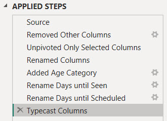

< [Portfolio](https://907sjl.github.io) | [Full Report](https://907sjl.github.io/pdf/Referral%20Wait%20Time.pdf) | [Overview](https://907sjl.github.io/referrals_powerbi/referrals_report) 

One way to measure access to care is timeliness.  Long delays to see a healthcare provider can speak to availability issues, either a lack of resources or inefficiencies that result in a less than optimal conversion of referrals into appointments. Long delays can also speak to accomodation issues or accessibility issues if patients have difficulty attending their scheduled appointments.
This project is an example of a report that I created to look at the process times for referred patients at specialty clinics. 

## Why Power BI? 
Why would I choose Power BI to create this report?  Power BI reports are both quick to manipulate and page formatted.  The combination of Power Query M Scripts and DAX measure calculations makes Power BI extremely nimble, as does the visual design interface for building reports.  There is a plethora of community support and freely accessible training for those who are new to Power BI.  A dashboard created in Power BI can also function as a page formatted report.  If you are faced with a typical business intelligence, rapid and iterative prototyping scenario where exploratory analysis is refined into repeatable process measurement then Power BI is a good choice.    

## Overview
Click [here](https://907sjl.github.io/referrals_powerbi/referrals_report) for an overview of the report.  The numerical values in these reports are fabricated and do not represent any real healthcare organization. 

## Data sources 
For the purposes of demonstration this example report loads data from three Comma Separated Values files.  The data in these files has been fabricated as an example.  It does not represent any real healthcare organization.   

- Referrals.csv
: A file containing one row for each referral and columns with the dates when each referral reached a process milestone.  Other columns are also included that are helpful for monthly monitoring.    

- DirectSecureMessages.csv
: A file containing one row for each Direct Secure Message about a patient that was sent to a referral inbox. These are used to measure how often messages are used in place of referrals.     

- StandardCalendar.csv
: Contains the data for the standard date dimension table used across reports.     

### Power Query ELT
    
Four custom groups and the one default group organize the Power Query loads, transforms, and ancillary constructs. 

    
Parameters are used here for two purposes.  The **data_date** parameter is used to fix the effective date of this report to a specific date.  Many of the measures in this report are based on the age of a referral.  Since this example is loaded from static files the effective date must be fixed in time in order to avoid every referral aging out of range.

```
= Table.AddColumn(#"Set Data Types", "Days to Accept", each if ([Date Accepted] = null) 
  then Duration.Days(Date.From(data_date) - [Date Referral Sent]) 
  else Duration.Days([Date Accepted] - [Date Referral Sent]))
```    
The **data_date** parameter is used to calculate the number of days that a referral waited to reach each of the process milestones.    

    
The **data_path** parameter provides a single, convenient location to set the directory where the report can find the data files to load.  The *Source* step of each source table references this parameter along with one of the other parameters containing the name of the file to load.    

    
This report makes use of the **GetAgeCategory** function to template a column transform that is used multiple times.  It assigns a distribution grouping to the number of days leading up to a process milestone.    

```
= (Days as any) as any => 
let
    Source = (if Days = null then null 
              else if Days <= 7 then "7d" 
              else if Days <= 14 then "14d" 
              else if Days <= 30 then "30d" 
              else if Days <= 60 then "60d" 
              else if Days <= 90 then "90d" else ">90d")
in
    Source
```    
The number of days is the parameter and the return value is the grouping category.      

    
The Data Loads group contains the extracts and loads from the source data files.  **Referral**, **Direct Secure Message**, and **Standard Calendar** each refer to the similarly named CSV file data source.  
 
    
**Referral Milestone** is a pivoted transformation of the referral process milestones into a vertical fact table rather than a horizontal list of milestone based attributes.  Doing so grants the ability to filter visuals on specific milestones and apply the same measure across one or more selected milestones.    

Transforming a horizontal list of milestone columns into a vertical fact table results in a simplified data model in that there are fewer dimensions playing a single role.  There is a single relationship between the dimension table and the fact table.    

This data structure also allows different dimension values to be placed side by side with measurements in bar chart visualizations for comparison.     

The transforms:
1. Reference the source **Referrals** table
1. Select the columns that are relevant for this table
1. Unpivot from a horizontal list of milestone dates and times to a vertical list
1. Tag each milestone wait time with an age category (using the **GetAgeCategory** function)
1. Clean up the source file naming and data types

    
Care has to be taken with this fact table because the days to each referral milestone are not additive.  In the example above the days until seen includes the days to accept and the days until scheduled.  The total days across all milestones is 13 days, and that is meaningless.  The median days to any one milestone across all referrals is meaningful, however.    

### Power BI Data Model 

h

h

h

h

h

h

h

h

h

h

h

h

h

h

h

h

h

h

h

h

h

