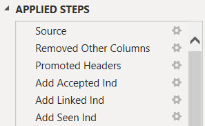
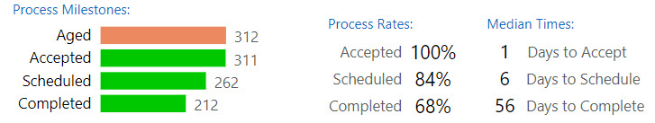
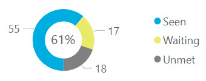
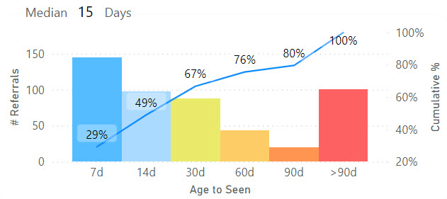
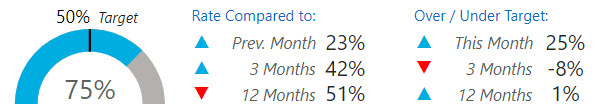
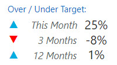
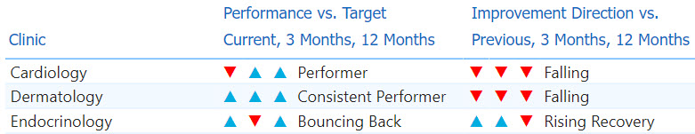
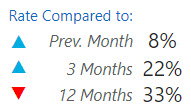

< [Portfolio](https://907sjl.github.io) | [Full Report](https://907sjl.github.io/pdf/Referral%20Process%20Measures.pdf) | [Overview](https://907sjl.github.io/referrals_powerbi/referrals_report) 

One way to measure access to care is timeliness.  Long delays to see a healthcare provider can speak to availability issues, either a lack of resources or inefficiencies that result in a less than optimal conversion of referrals into appointments. Long delays can also speak to accomodation issues or accessibility issues if patients have difficulty attending their scheduled appointments.
This project is an example of a report that I created to look at the process times for referred patients at specialty clinics. 

## Why Power BI? 
Why would I choose Power BI to create this report?  Power BI reports are both quick to manipulate and page formatted.  The combination of Power Query M Scripts and DAX measure calculations makes Power BI extremely nimble, as does the visual design interface for building reports.  There is a plethora of community support and freely accessible training for those who are new to Power BI.  A dashboard created in Power BI can also function as a page formatted report.  If you are faced with a typical business intelligence, rapid and iterative prototyping scenario where exploratory analysis is refined into repeatable process measurement then Power BI is a good choice.    

## Overview
Click [here](https://907sjl.github.io/referrals_powerbi/referrals_report) for an overview of the report.  The numerical values in these reports are fabricated and do not represent any real healthcare organization.  The script that created the data for this example can be found [in the create_referral_data folder](https://github.com/907sjl/referrals_powerbi/tree/main/create_referral_data).    

## Data sources 
For the purposes of demonstration this example report loads data from three Comma Separated Values files.    

- Referrals.csv
: A file containing one row for each referral and columns with the dates when each referral reached a process milestone.  Other columns are also included that are helpful for monthly monitoring.    

- DirectSecureMessages.csv
: A file containing one row for each Direct Secure Message about a patient that was sent to a referral inbox. These are used to measure how often messages are used in place of referrals.     

- StandardCalendar.csv
: Contains the data for the standard date dimension table used across reports.     

## Power Query ELT
    
Four custom groups and the one default group organize the Power Query loads, transforms, and ancillary constructs. 

### Parameters and Functions
    
Parameters are used here for two purposes.  The **data_date** parameter is used to fix the effective date of this report to a specific date.  Many of the measures in this report are based on the age of a referral.  Since this example is loaded from static files the effective date must be fixed in time in order to avoid every referral aging out of range.

```
= Table.AddColumn(#"Set Data Types", "Days to Accept", each if ([Date Accepted] = null) 
  then Duration.Days(Date.From(data_date) - [Date Referral Sent]) 
  else Duration.Days([Date Accepted] - [Date Referral Sent]))
```    
The **data_date** parameter is used to calculate the number of days that a referral waited to reach each of the process milestones.    

    
The **data_path** parameter provides a single, convenient location to set the directory where the report can find the data files to load.  The *Source* step of each source table references this parameter along with one of the other parameters containing the name of the file to load.    

    
This Power Query ELT makes use of the **GetAgeCategory** function to template a column transform.  The function assigns a distribution grouping bin to the number of days leading up to a process milestone.  Encapsulating business logic into functions places that logic in an easy to find location.  It also templates a transformation that may potentially be used more than once.  Changes can be made in a single place.    

```
= (Days as any) as any => 
let
    Source = (if Days = null then null 
              else if Days <= 7 then "7d" 
              else if Days <= 14 then "14d" 
              else if Days <= 30 then "30d" 
              else if Days <= 60 then "60d" 
              else if Days <= 90 then "90d" else ">90d")
in
    Source
```    
The number of days is the parameter and the return value is the grouping bin name.    

### Data Loads
    
The Data Loads group contains the extracts and loads from the source data files.  **Referral**, **Direct Secure Message**, and **Standard Calendar** each refer to the similarly named CSV file data source.  

### Referral Table 
The query for the **Referral** table loads records of referrals and processing dates from referrals.csv.   
    
This source file contains a horizontal list of columns representing the dates that each referral first reached processing milestones such as the date written, date sent, accepted, scheduled, and seen.

    
Table transforms add columns that indicate whether or not the referral has reached each process milestone.  These are used by DAX measures in the report.    

Adding calculated columns in Power Query balances out the overall time spent waiting for calculations while working with Power BI reports.  Calculations and filters written into DAX measures are processed when the filters change, the view page is changed, or visualization properties are changed.  In my time working with Power BI I have spent more time waiting for spinning wheel icons than actually working.  Loading a calculated column in Power Query shifts some processing to the data refresh.  

    
The number of days between milestones are also added to the table as calculated columns.  These columns are used to age referrals from the date when they are sent.  These ages are used to calculate median process timings. 

### Processing Time Table  
    
**Processing Time** is a pivoted transformation of the referral process metrics into a vertical fact table rather than a horizontal list of milestone attributes.  Doing so grants the ability to filter visuals on specific metrics and apply the same aggregation across one or more selected metrics.  Using this data structure also simplifies the use of bar charts to place different metrics side by side for comparison.    

Pivoting a horizontal list of milestone columns into a vertical fact table results in a simplified data model in that there are fewer dimensions playing a single role.  There is a single relationship between the dimension table and the fact table instead of multiple sub-classes of age category for each process metric.    

The transforms:
1. Reference the source **Referrals** table
1. Select the columns that are relevant for this table
1. Unpivot from a horizontal list of milestone dates and times to a vertical list
1. Tag each milestone wait time with an age category (using the **GetAgeCategory** function)
1. Clean up the source file naming and data types

    
Care has to be taken with this fact table because the days to each referral milestone are not additive.  In the example above the days until seen includes the days to accept and the days until scheduled.  The total days across all milestones is 13 days, and that is meaningless.  The median days to any one milestone across all referrals is meaningful, however.    

### Direct Secure Message Table 
The query for the **Direct Secure Message** table loads records of messages to referral inboxes from DirectSecureMessages.csv.  The query simply loads the file, typecasts, and renames columns.  These records are used to evaluate how often referrals are used to acquire new patients versus direct messaging.   

### Standard Calendar Table 
The query for the **Standard Calendar** table loads records of calendar dates and their pivotal attributes from StandardCalendar.csv.  This query simply loads the file and typecasts columns.  These records are used to create the date dimension for the report.  This dimension can play different roles in the data model by associating it with different date attributes in DAX measures.   

### Dimension Tables 
    
The queries in the Dimensions group fill tables representing the pivotal dimensions for reporting.  These tables can be related to multiple other tables that contain facts used in measures.  They can also contain attributes used to sort or filter dimension values in visualizations by something other than the dimension name.    

Three dimensions are sourced directly from the report definition.  They are entered into the Power Query and stored as JSON: 
- **Age Category** is a table of bins used to group referrals in timing distributions.  
- **Process Metric** is a table of referral process milestones and other time calculations used to monitor performance.  
- **Test of CRM Use** is a table of measure names used to test how often a clinic uses their Clinic Referral Management system versus only using the clinic schedule book for new patients.    

The **Clinic** dimension is sourced from the **Referral** table and represents the list of unique clinic names where referrals are sent.    

### Other Tables 
    
The default Other Queries group has one remaining table that doesn't fit with the other groups.  The **Report Measure** table is used to place separate metrics side-by-side in bar charts with axis labels.  Measures are added to a visualization by filtering on them instead of adding them to the visualization design.    

    
The records of the **Report Measure** table are entered into the Power Query and stored as JSON.  The name of each measure is stored along with columns that can be used to group measures together.  Bundles of related measures can be selected for a visualization by filtering on these columns.    

A DAX measure surfaces data for selected measures using a SWITCH statement on the measure name to pair it with the corresponding formula in DAX.  

## Power BI Data Model 
<a href="images/data_model.jpg"></a> 
Three tables host measures that are surfaced in report visualizations.  The **Referral**, **Processing Time**, and **Direct Secure Message** tables contain fact values.    

Specific data dimensions are persisted into tables due to their values existing in multiple fact tables, or their values are sorted by a column other than their description.  

    
The **Age Category** dimension table has an added column with a pre-defined sort order.  The sequence of the sort order reinforces the contextual meaning of the dimension name.  This sorting is neither based on alphabetical order nor volume of data.  This dimension's name column has its sort order overriden by the SortOrder column.     

    
This slicer is an example of filtering a dimension table versus an attribute of a table.  The **Clinic** dimension table has one-to-many relationships to both the **Referral** and **Direct Secure Message** tables.  If this slicer were connected to the Clinic column in either of those two tables it would only filter the records in the table that the slicer was connected to.  Connecting the slicer, or any filter, to the **Clinic** table filters both of the tables that it is related to.  Filtering the **Referral** table will also filter the **Processing Time** table by transition since **Referral** acts as a dimension in that relationship.    

The **Standard Calendar** table is the time dimension.  It is a table of calendar dates and attributes such as year and month that are used to filter and sort visualizations by date.  The time dimension can participate in multiple relationships to tables.  Each new relationship represents a role that dates play in measures.  The date when a referral is sent or the date when a referral is placed on hold, for example.  A single, more generalized date dimension creates a simpler data model compared to sub-classes of date dimensions for every role.  A single date slicer in a report filters measures by different dates using the USERELATIONSHIP function in DAX.  The report currently only uses a single dimension to each table but if the need arose it could be augmented with more relationships.    

A time dimension table is also required to use the time intelligence functions in DAX.    

## Power BI Report

In the scenario where this report is used we did not have access to the Power BI cloud service.  Customers receive PDF exports of report pages.  The free Desktop version of Power BI easily handled this and allowed for agile adjustments during the iterative investigation into valuable metrics.  Without the cloud premise there is no option for automating the delivery.  So then the next step to operationalize this report would be to either move it to the cloud or redo portions of it using a Python stack.    

Click [here](https://907sjl.github.io/referrals_powerbi/referrals_report) for an overview of the report.  The following sections describe the DAX measures behind some of the visualizations.    

This report surfaces operational metrics and process timings to convert referred patients to attended appointments.  The metrics calculate the rates that a clinic achieves process milestones and the number of days required.    

### Referral Status 
    
A referral will be in one of eight states from a process perspective.  A referral is written in the Clinic Referral Management system then sent to the specialty clinic.  The referral is also considered pending acceptance when it is sent.  At that point the referral is either accepted, cancelled, rejected, or sometimes closed because the referral must be forwarded to another organization.  The clinic accepts and schedules a referred patient when the case has been reviewed.  The patient is then seen and the referral is completed with a visit summary.    

### Volume of Referrals After 90 Days 
    

This horizontal bar chart represents the volume of referrals sent to a clinic alongside the number of those referrals that were canceled, rejected, or closed without being seen.  The referrals included in this visualization are all aged 90 days from the date they were sent to the clinic.  The timing for a referral to be scheduled, seen, and completed is calculated after 90 days.  The volumes in this bar chart explain the population size for the median timing metrics.    

This visualization is built upon a few layers of DAX measures.  
```
Count Sent after 90d = 
MAX(
  CALCULATE(DISTINCTCOUNTNOBLANK(Referral[Referral ID])
    , KEEPFILTERS(Referral[# Sent] > 0) 
    , DATEADD('Standard Calendar'[Date], -90, DAY) )
  , 0) 
```    
The core layer calculates the number of referrals sent to the clinic that aged 90 days.  The calculated column **# Sent** assists with this measure.  This column is either 1 or 0 for a single referral and sums to the number of referrals sent.  This column is created in the Power Query load to make the data model easier to read and use.    

A slicer on the report page selects a single month at a time.  The DAX function DATEADD is used as a filter in this measure to include referrals that reached 90 days of age during the month.  This works by filtering the **Standard Calendar** dimension to dates that are 90 days prior to each date in the currently selected month.  DATEADD passes a table with those dates to the CALCULATE function as a filter.    
    
The **Referral** table and the **Standard Calendar** table share a relationship on the date when the referral is sent to the clinic.  Filtering **Standard Calendar** also filters **Referral** to those that were sent 90 days prior to any date in the selected month.    

```
Count Canceled after 90d = 
  CALCULATE([Count Sent after 90d]  
    , KEEPFILTERS(Referral[Referral Status] IN {"Cancelled"}) ) 

Count Rejected after 90d = 
  CALCULATE([Count Sent after 90d] 
    , KEEPFILTERS(Referral[Referral Status] IN {"Rejected"}) )
```    
The counts of canceled and rejected referrals build on to the **Count Sent after 90d** measure by adding filters to focus on those specific subsets of referrals that were sent.  The canceled and rejected referrals are highlighted in this visual because they are not included in the percentage of referrals seen.  This way it is possible to reach 100% of referrals seen.    

```
Count Referrals Closed WBS after 90d = 
  CALCULATE([Count Sent after 90d] 
    , KEEPFILTERS(Referral[Referral Status] IN {"Completed", "Closed"} 
        && ISBLANK(Referral[Date Referral Seen]) 
        && ISBLANK(Referral[Date Patient Checked In]) ) )
```    
Referrals are counted as closed without being seen if they are sent but then completed or closed without any data to indicate that the patient was seen.  These referrals are also removed from the percentages of referrals that are seen.    

An additional layer of DAX overlays these measures and surfaces them to the bar chart visual.  This is the **Report Measure** table described in the Power Query ELT.  **Report Measure** holds a measure that acts as a switchboard of measures.  

```
Measured Whole Number Value = 
  SWITCH(MIN('Report Measure'[Measure Name]), 
    "Count Linked after 90d", [Count Linked after 90d], 
    "Count Scheduled after 90d", [Count Scheduled after 90d],
    "Count Tagged as Seen after 90d", [Count Tagged as Seen after 90d],
    "Count Seen or Checked In after 90d", [Count Seen or Checked In after 90d],
    "Count Rejected after 90d", [Count Rejected after 90d],
    "Count Canceled after 90d", [Count Canceled after 90d],
    "Count Referrals Closed WBS after 90d", [Count Referrals Closed WBS after 90d],
    "Count Sent after 90d", [Count Sent after 90d],
    ...
```    
This measure is assigned to the bar chart visual as the X-axis.  
    
This allows multiple, separate measures like the ones shown above to appear side-by-side as bars with labels in the Y-axis.  This also allows measures to be included using filters on the visual.    
    
This visual includes all measures with an attribute value of **Sent** in the **Milestone** column.  If this report is published interactively in the cloud service this also introduces interesting capabilities for the viewer to customize the page.    

### Process Rates After 90 Days 
    
Referrals are aged if they are sent to a clinic and kept.  Aged referrals are included in process metrics.  This bar chart compares the number of referrals that have reached each of the process milestones 90 days after they are sent.    

```
Count Referrals after 90d = 
MAX(
  CALCULATE(SUM(Referral[# Aged]) 
    , DATEADD('Standard Calendar'[Date], -90, DAY) ) 
  , 0)
```
The DAX measures for this chart are based on the number of aged referrals.  Aged referrals are those that are sent to a clinic and not rejected, canceled, or closed without being seen. **# Aged** is calculated for each referral record as a 1 or 0.  Similar to **# Sent**, this column is calculated in the Power Query load and is meant to make the data model easier to read and use.    

``` 
Count Accepted after 90d = 
CALCULATE([Count Referrals after 90d]
  , KEEPFILTERS(Referral[# Accepted] > 0) )

Count Scheduled after 90d = 
CALCULATE([Count Referrals after 90d] 
  , KEEPFILTERS(Referral[# Linked to Appts] > 0 || Referral[# Similar Appts Scheduled] > 0) )

Count Completed after 90d = 
CALCULATE([Count Referrals after 90d]
  , KEEPFILTERS(Referral[# Completed] > 0) )
```
The remaining measures in the bar chart filter the **Count Referrals after 90d** measure to count referrals that have reached specific milestones, reached 90 days of age, and are considered aged referrals.    

```
Rate Accepted after 90d = DIVIDE([Count Accepted after 90d], [Count Referrals after 90d], 0)
Rate Scheduled after 90d = DIVIDE([Count Scheduled after 90d], [Count Referrals after 90d], 0)
Rate Seen after 90d = DIVIDE([Count Seen or Checked In after 90d], [Count Referrals after 90d], 0)
```
Rates matching the bar chart counts are listed to the right of the chart.  The number of aged referrals is the denominator for each of the process rates.  These measures build upon the previous count measures by dividing the milestone counts into the count of aged referrals.    

```
Median Days to Milestone after 90d = 
MAX(
  CALCULATE(MEDIAN('Processing Time'[Days to Milestone]) 
      , KEEPFILTERS(Referral[# Aged] > 0) 
      , DATEADD('Standard Calendar'[Date], -90, DAY) )
  , 0) 
```    
The median times to reach each milestone include all aged referrals.  Referrals that have not reached the milestone yet are aged to the report date.  The **Median Days to Milestone after 90d** measure calculates the median number of days to all milestones using the **Processing Time** table and by filtering the **Referral** table to the referrals that are aged and reached 90 days of age during the selected month.  **Referral** is a dimension table related to **Processing Time**.    

### Rate Seen, Waiting, or Unmet    
    
After 90 days the number of referrals seen, those waiting for their appointment date, and those not yet scheduled are displayed with their relative proportions in a pie chart.  Any referrals not scheduled after 90 days are labeled as unmet.    

```
Count Seen or Checked In after 90d = 
  CALCULATE([Count Referrals after 90d] 
    , KEEPFILTERS(Referral[# Seen or Checked In] > 0) ) 

Count Referrals Waiting after 90d = 
CALCULATE([Count Referrals after 90d] 
    , KEEPFILTERS(Referral[# Seen or Checked In] == 0) 
    , KEEPFILTERS(Referral[# Linked to Appts] > 0 || Referral[# Similar Appts Scheduled] > 0) )

Count Referrals Unmet after 90d = 
  [Count Referrals after 90d] - [Count Seen or Checked In after 90d] - [Count Referrals Waiting after 90d] 
```    
These measures all build upon the count of referrals aged after 90 days.  An unmet referral is one that is neither seen nor scheduled for an appointment after 90 days.    

```
Rate Seen after 90d = DIVIDE([Count Seen or Checked In after 90d], [Count Referrals after 90d], 0)
```    
The percentage of referrals seen after 90 days is the count of referrals seen divided into the count of all referrals aged after 90 days.    

### Days to Seen with Distribution
    
Distribution bins group referrals by the number of days to be seen.  This is accomplished via the relationship between **Processing Time** and the bin names in **Age Category**.  Any referrals not yet seen will be counted in the >90d category.    

```
Count Referrals by Age to Milestone after 90d = 
MAX(
  CALCULATE(
    DISTINCTCOUNTNOBLANK('Processing Time'[Referral ID])
    , KEEPFILTERS(Referral[# Aged] > 0) 
    , DATEADD('Standard Calendar'[Date], -90, DAY) ) 
  , 0)
```    
The bars visualize the measure **Count Referrals by Age to Milestone after 90d**.  The **Processing Time** table has a relationship to **Age Category** and so referrals that are aged must be counted from this table for the age bins.    

```
Cumulative Referrals by Age to Milestone after 90d = 
CALCULATE([Count Referrals by Age to Milestone after 90d]
    , FILTER(ALL('Age Category'), 'Age Category'[SortOrder] <= MAX('Age Category'[SortOrder])) )  
```
The line with the cumulative number of referrals seen across age categories builds upon the measure for the bars using FILTER to forceably replace the grouping by age category with an aggregate over all age categories.  This measure plays on the fact that the current context in the visualization has an age category filter.  This measure replaces the visualization's group with a sum across all age categories that have a sort value less than the visualization's group.    

The chart still calculates this measure for every age category group.  Each calculation includes the referrals in an age category prior to the current one.    

```
Cumulative Pct Referrals by Age to Milestone after 90d = 
DIVIDE( 
  'Processing Time'[Cumulative Referrals by Age to Milestone after 90d] 
  , [Count Referrals after 90d]
  , 0) 
```
Then the cumulative percentage is just the cumulative numerator divided into the count of all referrals that reached 90 days of age.    

### Routine Referrals Seen in 30 Days    
    
The percentage of referrals seen in 30 days is a patient access metric.  These are the referrals that have reached 30 days of age in the selected month and were seen in that time.  The rate of referrals seen in 30 days is visualized with a gauge that has a setpoint for the target rate.    

```
Count Routine Referrals after 30d = 
MAX(
  CALCULATE(SUM(Referral[# Aged]) 
    , KEEPFILTERS(Referral[Referral Priority] = "Routine")
    , DATEADD('Standard Calendar'[Date], -30, DAY) )
  , 0)
```    
**Count Routine Referrals after 30d** is the denominator of the rate.  This measure calculates the number of referrals that were sent 30 days before any day in the currently selected month.  The referrals must aged, meaning they are not canceled, rejected, or closed without being seen.  It also filters to referrals having a routine priority as opposed to urgent.    

```
Count Routine Seen after 30d = 
CALCULATE([Count Routine Referrals after 30d]
    , KEEPFILTERS(Referral[# Seen or Checked In] > 0) ) 

Count Routine Seen in 30d = 
CALCULATE([Count Routine Seen after 30d]
    , KEEPFILTERS(Referral[Days until Patient Seen]<31) ) 
```    
The numerator is the number of referrals seen in 30 days.  Two measures filter the denominator measure to calculate the numerator.  **Count Routine Seen after 30d** filters the referrals to those that were seen and is used to calculate the percentage of referrals seen after 30 days.  **Count Routine Seen in 30d** filters the referrals seen to those that were specifically seen 30 days or less after they were sent.    

```
Rate Routine Seen in 30d = 
DIVIDE(
  [Count Routine Seen in 30d]
  , [Count Routine Referrals after 30d] 
  , 0 ) 
```    
Then the metric is the count of referrals seen in 30 days divided into the referrals that have reached 30 days of age and were not rejected, canceled, or closed without being seen.    

    
A table to the right of the metric displays a comparison of historical average rates against the target rate.  Up or down indicators help to visualize the comparisons at a glance.  The numerical values are the difference between the historical rates and the target rate.    

```
Count Routine after 30d 12-Mths = 
MAX(
  CALCULATE(SUM(Referral[# Aged]) 
    , KEEPFILTERS(Referral[Referral Priority] = "Routine")
    , FILTER(ALL('Standard Calendar'[Date])
        , 'Standard Calendar'[Date] >= MINX('Standard Calendar'
                                        , DATEADD(DATEADD('Standard Calendar'[Date], -11, MONTH), -30, DAY))
          && 'Standard Calendar'[Date] <= MAXX('Standard Calendar'
                                            , DATEADD('Standard Calendar'[Date], -30, DAY)) ) 
  )
  , 0)
```    
Customized date criteria is used to create the historical average rates for the previous 12 months and the previous three months.  The customized criteria in this measure has two goals, to include referrals as of the previous 12 monthly periods and to include referrals that reached 30 days of age in each of those months.    

The FILTER function forcefully overrides any other filters on **Standard Calendar** and the ALL function includes all records in this filter regardless of the slicer selection.  Because FILTER is used instead of KEEPFILTERS this measure will not cooperate with date criteria in other measures.  This measure stands alone without building upon other measures even if they are similar.    

Nested DATEADD functions play on the fact that a slicer is selecting a date context for the report.  They first roll back the selected dates by 11 months and then roll those dates back 30 days to reflect the dates that would be used to measure referrals 11 months prior.  DATEADD creates a table of dates to be used as a filter.  Then MINX, a table aggregate, is applied to every date in that table result to find the earliest date to use for this measure.    

```
Count Routine Seen in 30d 12-Mths = 
CALCULATE([Count Routine after 30d 12-Mths]
    , KEEPFILTERS(Referral[Days until Patient Seen]<31) ) 

Rate Routine Seen in 30d 12-Mths = 
DIVIDE(
  [Count Routine Seen in 30d 12-Mths]
  , [Count Routine after 30d 12-Mths] 
  , 0 ) 
```    
With the **Count Routine after 30d 12-Mths** measure as the denominator of the 12 month rate, the numerator can build upon that measure to select only the referrals that were specifically seen within 30 days from when the referrals was sent.    

```
Target Routine Seen in 30d = 0.5

Performance Variance Routine Seen in 30d 12-Mths = [Rate Routine Seen in 30d 12-Mths] - [Target Routine Seen in 30d]
```    
There are only two target rates in this report.  A DAX measure **Target Routine Seen in 30d** serves as a global constant with the target rate for this metric.  In a more complicated scenario a table of targets would be used instead.    

```
Performance Direction Routine Seen in 30d 12-Mths = 
  if([Performance Variance Routine Seen in 30d 12-Mths] > 0, "▲"
    , if([Performance Variance Routine Seen in 30d 12-Mths] < 0, "▼"
      , "-"))
```    
The up or down indicator is provided by a DAX function attached to a card visual.  ASCII has characters representing triangles in both orientations.  A standard color rule is assigned to the card visual based on the value of the variance between the metric and the target.    

### Improvement Direction 
    
Two tables provide a consolidated and concise interpretation of the referral throughput metrics over 12 months for routine referrals seen in 30 days and urgent referrals seen in five days.    

There are two groups of indicators and categories.  The first group of columns compares the performance to the target rate for three time periods:
- The current month rate over or under the target rate,
- The aggregate three month rate over or under the target rate, 
- The aggregate 12-month rate over or under the target rate.    

Three direction indicators are grouped from left-to-right for these time periods.  The category name to the right of those indicators describes the overall 12 month performance qualitatively.    

The second group of columns describe the improvement direction of each clinic across three time periods:
- The current month rate compared to the previous month, 
- The current month rate compared to the aggregate three month rate, 
- The aggregate three month rate compared to the aggregate 12-month rate.    

The category name to the right describes the overall 12 month improvement direction in qualitative terms.    

```
Improvement Category Routine Seen in 30d = 
  SWITCH([Improvement Score Routine Seen in 30d] 
    , 111, "Rising" 
    , 11, "Rising Recovery" 
    , 110, "Rising" 
    , 10, "Setback Recovery" 
    , 101, "Bouncing Back" 
    , 1, "Turning Upward" 
    , 100, "Falling" 
    , 0, "Falling" ) 
```    
A DAX function supplies the improvement or performance category using a total score for each clinic and a SWITCH statement to return the category based on the score.  The score functions like a mask.  The ones place is either 1 or 0, 1 if the first indicator arrow is up and 0 if down.  The tens place is either 10 or 0 depending upon the second indicator arrow for the three month performance.  The hundreds place is either 100 or 0 depending upon the third indicator arrow for the 12-month performance.    

```
Improvement Score Routine Seen in 30d = 
  [Improvement Score vs Prev Mth Routine Seen in 30d] 
    + [Improvement Score Routine Seen in 30d 3-Mths] 
      + [Improvement Score Routine Seen in 30d 12-Mths]

Improvement Score vs Prev Mth Routine Seen in 30d = 
  if([Improvement Variance vs Prev Mth Routine Seen in 30d] > 0, 1
    , if([Improvement Variance vs Prev Mth Routine Seen in 30d] < 0, 0
      , 0) )

Improvement Score Routine Seen in 30d 3-Mths = 
  if([Improvement Variance Routine Seen in 30d 3-Mths] > 0, 10
    , if([Improvement Variance Routine Seen in 30d 3-Mths] < 0, 0
      , 10) )

Improvement Score Routine Seen in 30d 12-Mths = 
  if([Improvement Variance Routine Seen in 30d 12-Mths] > 0, 100
    , if([Improvement Variance Routine Seen in 30d 12-Mths] < 0, 0
      , 100) )
```    
The improvement score is calculated by comparing the variances between the current month rate to the previous month rate, the current month rate to the three month rate, and the three month rate to the 12-month rate.    

The performance score is calculated in a similar manner except that the current rate, three month rate, and 12-month rate are each compared against the target rate for the metric.    

    
A page for each clinic shows the individual rates that are being compared next to the gauge with the current month's rate.    

### Data Driven Colors 
    
Bar chart visuals provide a way to color the bars using measures.  Measures can be used with a ladder of rules that are configured in the visual and select colors based on the measure's value.  If you plan to use the same rules in more than one column or visual this creates redundant work to set up and maintain the rules.    

```
Color by Category = SWITCH(
  MAX('Age Category'[Age Category]) 
  , "7d", [Color 7d] 
  , "14d", [Color 14d] 
  , "30d", [Color 30d] 
  , "60d", [Color 60d] 
  , "90d", [Color 90d] 
  , ">90d", [Color Over 90d] 
) 

Color by Days until Scheduled = SWITCH(
  TRUE() 
  , ([Median Days until Scheduled after 90d] < 8.0), [Color 7d] 
  , ([Median Days until Scheduled after 90d] >= 8.0) && ([Median Days until Scheduled after 90d] < 15.0), [Color 14d] 
  , ([Median Days until Scheduled after 90d] >= 15.0) && ([Median Days until Scheduled after 90d] < 31.0), [Color 30d] 
  , ([Median Days until Scheduled after 90d] >= 31.0) && ([Median Days until Scheduled after 90d] < 61.0), [Color 60d] 
  , ([Median Days until Scheduled after 90d] >= 61.0) && ([Median Days until Scheduled after 90d] < 91.0), [Color 90d] 
  , ([Median Days until Scheduled after 90d] >= 91.0), [Color Over 90d] 
)
```    
This report uses DAX measures to encapsulate the rules and return a single color value to a chart instead.    

```
Color 7d = "#55BCFF"
Color 14d = "#AADAFF"
... 
Color Over 90d = "#FD6262"
```    
The specific color values are held in individual DAX measures that function as constants, pairing a color value with a meaning.  Color values can be changed at once across multiple sets of rules that use the colors in multiple visuals.    

This report uses colors to create a heat map style gradient based on the number of days that a referral aged before the patient was seen.  Ages are grouped into distribution bins, and each bin has a color along the gradient based on the number of days relative to other bins.  The color values in this example were chosen so that the color of each bin is distinctive for those with one of the three most common color sight variances in addition to those with normal color sight.  The most effective change is to replace green with blue.    

The constant color measures allow colors to be changed in this way across the report.  Power BI doesn't allow all color properties to be data driven with measures unfortunately.  Older tools like QlikView were more customizable in this way.  Hopefully Microsoft will come around to creating more measure hooks for configuration properties.    

### Display Folders for Data Elements
    
This report resulted in a large collection of measures with different inclusion criteria that build upon one another.  They are organized into display folders as are the table attributes.  The measures are organized by the time frame of the inclusion criteria.    
