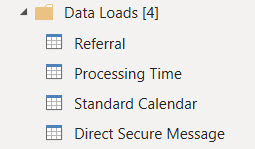
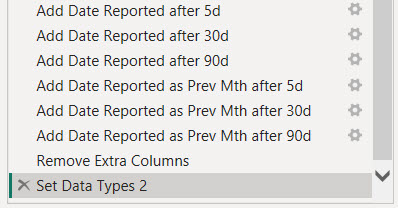

< [Portfolio](https://907sjl.github.io) | [Full Report](https://907sjl.github.io/pdf/Referral%20Wait%20Time.pdf) | [Overview](https://907sjl.github.io/referrals_powerbi/referrals_report) 

One way to measure access to care is timeliness.  Long delays to see a healthcare provider can speak to availability issues, either a lack of resources or inefficiencies that result in a less than optimal conversion of referrals into appointments. Long delays can also speak to accomodation issues or accessibility issues if patients have difficulty attending their scheduled appointments.
This project is an example of a report that I created to look at the process times for referred patients at specialty clinics. 

## Why Power BI? 
Why would I choose Power BI to create this report?  Power BI reports are both quick to manipulate and page formatted.  The combination of Power Query M Scripts and DAX measure calculations makes Power BI extremely nimble, as does the visual design interface for building reports.  There is a plethora of community support and freely accessible training for those who are new to Power BI.  A dashboard created in Power BI can also function as a page formatted report.  If you are faced with a typical business intelligence, rapid and iterative prototyping scenario where exploratory analysis is refined into repeatable process measurement then Power BI is a good choice.    

## Overview
Click [here](https://907sjl.github.io/referrals_powerbi/referrals_report) for an overview of the report.  The numerical values in these reports are fabricated and do not represent any real healthcare organization. 

## Data sources 
For the purposes of demonstration this example report loads data from three Comma Separated Values files.  The data in these files has been fabricated as an example.  It does not represent any real healthcare organization.   

- Referrals.csv
: A file containing one row for each referral and columns with the dates when each referral reached a process milestone.  Other columns are also included that are helpful for monthly monitoring.    

- DirectSecureMessages.csv
: A file containing one row for each Direct Secure Message about a patient that was sent to a referral inbox. These are used to measure how often messages are used in place of referrals.     

- StandardCalendar.csv
: Contains the data for the standard date dimension table used across reports.     

## Power Query ELT
    
Four custom groups and the one default group organize the Power Query loads, transforms, and ancillary constructs. 

### Parameters and Functions
    
Parameters are used here for two purposes.  The **data_date** parameter is used to fix the effective date of this report to a specific date.  Many of the measures in this report are based on the age of a referral.  Since this example is loaded from static files the effective date must be fixed in time in order to avoid every referral aging out of range.

```
= Table.AddColumn(#"Set Data Types", "Days to Accept", each if ([Date Accepted] = null) 
  then Duration.Days(Date.From(data_date) - [Date Referral Sent]) 
  else Duration.Days([Date Accepted] - [Date Referral Sent]))
```    
The **data_date** parameter is used to calculate the number of days that a referral waited to reach each of the process milestones.    

    
The **data_path** parameter provides a single, convenient location to set the directory where the report can find the data files to load.  The *Source* step of each source table references this parameter along with one of the other parameters containing the name of the file to load.    

    
This report makes use of the **GetAgeCategory** function to template a column transform that is used multiple times.  It assigns a distribution grouping to the number of days leading up to a process milestone.    

```
= (Days as any) as any => 
let
    Source = (if Days = null then null 
              else if Days <= 7 then "7d" 
              else if Days <= 14 then "14d" 
              else if Days <= 30 then "30d" 
              else if Days <= 60 then "60d" 
              else if Days <= 90 then "90d" else ">90d")
in
    Source
```    
The number of days is the parameter and the return value is the grouping category.      

### Data Loads
    
The Data Loads group contains the extracts and loads from the source data files.  **Referral**, **Direct Secure Message**, and **Standard Calendar** each refer to the similarly named CSV file data source.  

### Referral Table 
The query for the **Referral** table loads records of referrals and processing dates from referrals.csv.   
    
This source file contains a horizontal list of columns representing the dates that each referral first reached processing milestones such as the date written, date sent, accepted, scheduled, and seen.

    
Table transforms add columns that indicate whether or not the referral has reached each process milestone.  These are used by DAX measures in the report.    

Adding calculated columns in Power Query balances out the overall time spent waiting for calculations while working with Power BI reports.  Calculations and filters written into DAX measures are processed when the filters change, the view page is changed, or visualization properties are changed.  In my time working with Power BI I have spent more time waiting for spinning wheel icons than actually working.  Loading a calculated column in Power Query shifts some processing to the data refresh.  

    
The number of days between milestones are also added to the table as calculated columns.  These columns are used to age referrals from the date when they are sent.  These ages are used to calculate median process timings. 

    
Finally the query uses the **GetAgeCategory** function to assign a category to the number of days a referral has been on hold or pending reschedule.  This creates two, separate dimension columns for each type of age category, on hold or pending reschedule.    

These two dimension columns are related in that they are a sub-class of age categories.  The **Referral Milestone** table that follows is an example where a pivoted transform can model these two, separate sub-classes of age category as the more general class of **Age Category** in a single dimension table and a single fact.   

However, the measures and visualizations for days on hold and days pending reschedule are never in the same chart.  Treating these age categories as columns of a referral is convenient and also intuitive for consumers of the data model.  This ELT creates both a wide, less normalized reporting table in **Referral** and a step towards a proper star schema with milestone as a dimension in **Referral Milestone**.    

### Referral Milestone Table  
    
**Referral Milestone** is a pivoted transformation of the referral process milestones into a vertical fact table rather than a horizontal list of milestone attributes.  Doing so grants the ability to filter visuals on specific milestones and apply the same measure across one or more selected milestones.  Using this data structure also simplifies the use of bar charts to place different milestones side by side for comparison.    

Pivoting a horizontal list of milestone columns into a vertical fact table results in a simplified data model in that there are fewer dimensions playing a single role.  There is a single relationship between the dimension table and the fact table instead of multiple sub-class dimensions of age category.    

The transforms:
1. Reference the source **Referrals** table
1. Select the columns that are relevant for this table
1. Unpivot from a horizontal list of milestone dates and times to a vertical list
1. Tag each milestone wait time with an age category (using the **GetAgeCategory** function)
1. Clean up the source file naming and data types

    
Care has to be taken with this fact table because the days to each referral milestone are not additive.  In the example above the days until seen includes the days to accept and the days until scheduled.  The total days across all milestones is 13 days, and that is meaningless.  The median days to any one milestone across all referrals is meaningful, however.    

### Direct Secure Message Table 
The query for the **Direct Secure Message** table loads records of messages to referral inboxes from DirectSecureMessages.csv.  The query simply loads the file, typecasts, and renames columns.  These records are used to evaluate the use of referrals to acquire new patients versus direct messaging.   

### Standard Calendar Table 
The query for the **Standard Calendar** table loads records of calendar dates and their pivotal attributes from StandardCalendar.csv.  This query simply loads the file and typecasts columns.  These records are used to create the date dimension for the report.  This dimension will play many roles in the data model.   

### Dimension Tables 
    
The queries in the Dimensions group fill tables representing the pivotal dimensions for reporting.  These tables can be related to multiple other tables that contain facts used in measures.  They can also contain attributes used to sort or filter dimension values in visualizations by something other than the dimension name.    

Three dimensions are sourced directly from the report definition.  They are entered into the Power Query and stored as JSON: 
- **Age Category** is a table of bins used to group referrals in timing distributions.  
- **Milestone** is a table of referral process milestones.  
- **Test of CRM Use** is a table of measure names used to test how often a clinic uses their Clinic Referral Management system versus only using the clinic schedule book for new patients.    

The **Clinic** dimension is sourced from the **Referral** table and represents the list of unique clinic names where referrals are sent.    

### Other Tables 
    
The default Other Queries group has one remaining table that doesn't fit with the other groups.  The **Measure** table is used to place separate measures side-by-side in bar charts with axis labels.  Measures are added to a visualization by filtering on them instead of adding them to the visualization design.    

    
The records of the **Measure** table are entered into the Power Query and stored as JSON.  The name of each measure is stored along with columns that can be used to group measures together.  Bundles of related measures can be selected for a visualization by filtering on these columns.    

A DAX measure surfaces data for selected measures using a SWITCH statement on the measure name to pair it with the corresponding formula in DAX.  

## Power BI Data Model 
<a href="images/data_model.jpg"></a> 
Three tables host measures that are surfaced in report visualizations.  The **Referral**, **Referral Milestone**, and **Direct Secure Message** tables contain fact values.    

Specific data dimensions are persisted into tables due to their values existing in multiple fact tables, or their values are sorted by a column other than their description.  

    
The **Age Category** dimension table has an added column with a pre-defined sort order.  The sequence of the sort order reinforces the contextual meaning of the dimension name.  This sorting is neither based on alphabetical order nor volume of data.  This dimension's name column has its sort order overriden by the SortOrder column.     

    
This slicer is an example of filtering a dimension table versus an attribute of a table.  The **Clinic** dimension table has one-to-many relationships to both the **Referral** and **Direct Secure Message** tables.  If this slicer were connected to the Clinic column in either of those two tables it would only filter the records in the table that the slicer was connected to.  Connecting the slicer, or any filter, to the **Clinic** table filters both of the tables that it is related to.  Filtering the **Referral** table will also filter the **Referral Milestone** table by transition since **Referral** acts as a dimension in that relationship.    

The **Standard Calendar** table is the time dimension.  It is a table of calendar dates and attributes such as year and month that are used to filter and sort visualizations by date.    

This table participates in multiple relationships to both the **Referral** and **Direct Secure Message** tables.  Each of these relationships represents a role that dates play in measures.  The date when a referral is sent or the date when a referral is placed on hold, for example.  A single, more generalized date dimension allows for a simpler data model compared to persisting a sub-class of date dimensions for each role.  A single date slicer in a report filters measures referencing different dates by way of the USERELATIONSHIP function in DAX.    
